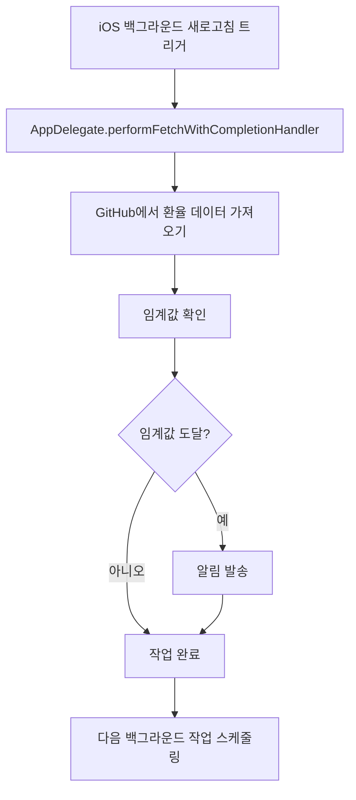

# 🔄 백그라운드 새로고침 가이드

환율알라미 앱의 백그라운드 새로고침 기능에 대한 상세한 설명과 설정 방법을 안내합니다.

## 📱 개요

환율알라미는 iOS의 백그라운드 새로고침 기능을 활용하여 앱이 백그라운드에 있을 때도 환율 데이터를 주기적으로 업데이트하고, 설정한 임계값에 도달했을 때 알림을 발송합니다.

## ⚙️ iOS 설정 방법

### 1. iOS 설정 > 일반 > 백그라운드 새로고침
1. **설정** 앱을 열기
2. **일반** 선택
3. **백그라운드 새로고침** 선택
4. **환율알라미** 앱을 찾아서 토글 스위치 활성화

### 2. iOS 설정 > 환율알라미 > 알림
1. **설정** 앱을 열기
2. **환율알라미** 앱 선택
3. **알림** 선택
4. **알림 허용** 토글 스위치 활성화

## 🔧 기술적 구현

### 백그라운드 모드
앱은 다음 두 가지 백그라운드 모드를 지원합니다:

```xml
<key>UIBackgroundModes</key>
<array>
    <string>fetch</string>
    <string>processing</string>
</array>
```

### iOS 버전별 지원

#### iOS 13+ (BackgroundTasks 프레임워크)
- `BGAppRefreshTask`를 사용한 백그라운드 작업 스케줄링
- 더 정확하고 효율적인 백그라운드 작업 관리
- 시스템 리소스 최적화

#### iOS 12 이하 (Legacy 방식)
- `setMinimumBackgroundFetchInterval`을 사용
- `performFetchWithCompletionHandler`로 백그라운드 fetch 처리

### 백그라운드 작업 스케줄링
```swift
// iOS 13+ 백그라운드 작업 스케줄링
@available(iOS 13.0, *)
private func scheduleBackgroundTask() {
    let request = BGAppRefreshTaskRequest(identifier: "com.exchangealert.refresh")
    request.earliestBeginDate = Date(timeIntervalSinceNow: 5 * 60) // 5분 후
    
    try BGTaskScheduler.shared.submit(request)
}
```

## 📊 알림 임계값

백그라운드에서 다음 임계값을 기준으로 알림을 발송합니다:

- **USD 상한선**: 1,400원 이상
- **USD 하한선**: 1,350원 이하

### 알림 메시지 예시
- 상한선 도달: "💰 USD 환율이 1400.00원에 도달했습니다!"
- 하한선 도달: "📉 USD 환율이 1350.00원까지 하락했습니다!"

## 🔍 백그라운드 작업 흐름



## 📈 백그라운드 새로고침 빈도

iOS는 다음 요소들을 고려하여 백그라운드 새로고침 빈도를 결정합니다:

1. **앱 사용 패턴**: 앱을 얼마나 자주 사용하는지
2. **배터리 상태**: 배터리 잔량과 충전 상태
3. **네트워크 상태**: Wi-Fi 또는 셀룰러 연결 상태
4. **시간대**: 일반적인 사용 시간대
5. **기기 사용량**: 기기 전체 사용 패턴

### 권장 사용법
- **앱을 정기적으로 사용**하여 iOS가 백그라운드 새로고침을 더 자주 실행하도록 유도
- **Wi-Fi 환경에서 사용**하면 더 자주 백그라운드 업데이트 실행
- **배터리 절약 모드 비활성화** (설정 > 배터리 > 배터리 절약 모드)

## 🛠️ 문제 해결

### 백그라운드 새로고침이 작동하지 않는 경우

#### 1. iOS 설정 확인
- [ ] 설정 > 일반 > 백그라운드 새로고침 > 환율알라미 활성화
- [ ] 설정 > 환율알라미 > 알림 > 알림 허용 활성화
- [ ] 배터리 절약 모드 비활성화

#### 2. 앱 사용 패턴 개선
- 앱을 매일 몇 번씩 사용
- 백그라운드로 보내기 전에 몇 분간 앱 사용
- Wi-Fi 환경에서 주로 사용

#### 3. 기기 재부팅
- 기기를 재부팅하여 백그라운드 새로고침 설정 재적용

#### 4. 앱 재설치
- 앱을 완전히 삭제하고 재설치
- 모든 백그라운드 새로고침 기록 초기화

### 알림이 오지 않는 경우

#### 1. 알림 권한 확인
- 설정 > 환율알라미 > 알림 > 알림 허용 활성화
- 설정 > 알림 > 환율알라미 > 알림 허용 활성화

#### 2. 방해 금지 모드 확인
- 설정 > 방해 금지 모드 비활성화
- 또는 환율알라미를 방해 금지 모드 예외로 설정

#### 3. 알림 스타일 확인
- 설정 > 환율알라미 > 알림 > 알림 스타일을 "배너" 또는 "알림"으로 설정

## 📝 로그 확인

백그라운드 새로고침 작동 상태를 확인하려면 Xcode 콘솔에서 다음 로그를 확인하세요:

```
✅ 백그라운드 fetch 시작
✅ GitHub에서 환율 데이터 가져오기 성공
🔍 백그라운드 알림 체크 - 현재: 1395.50, 상한: 1400.0, 하한: 1350.0
📢 상한선 알림 발송: USD 환율이 1400.00원에 도달했습니다!
✅ 백그라운드 알림 발송 성공
✅ 백그라운드 fetch 완료
```

## 🔒 개인정보 보호

백그라운드 새로고침 시에는 다음 데이터만 처리됩니다:
- 환율 데이터 (GitHub API에서 가져옴)
- 사용자 설정한 알림 임계값
- 알림 발송 기록

개인정보는 수집하거나 전송하지 않습니다.

## 📞 지원

백그라운드 새로고침 관련 문제가 지속되는 경우:
1. 앱을 최신 버전으로 업데이트
2. iOS를 최신 버전으로 업데이트
3. 위의 문제 해결 단계를 순서대로 시도

---

**참고**: 백그라운드 새로고침은 iOS 시스템이 제어하는 기능으로, 앱 개발자가 직접 빈도를 조절할 수 없습니다. iOS가 배터리 수명과 성능을 고려하여 자동으로 최적의 빈도를 결정합니다.
